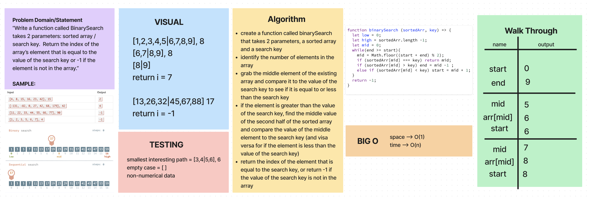

# Challenge Title

WhiteBoard Challenge for binary search in an array
<!-- Description of the challenge -->

## Whiteboard Process
<!-- Embedded whiteboard image -->

## Approach & Efficiency

The function identifies how long the array is then finds the middle by dividing the start and end by two. the function then checks if the key number is greater, then the mid if it is the mid decrements by one, if it isn't the mid increments by one. This process continues until the function finds the correct number.
<!-- What approach did you take? Why? What is the Big O space/time for this approach? -->
