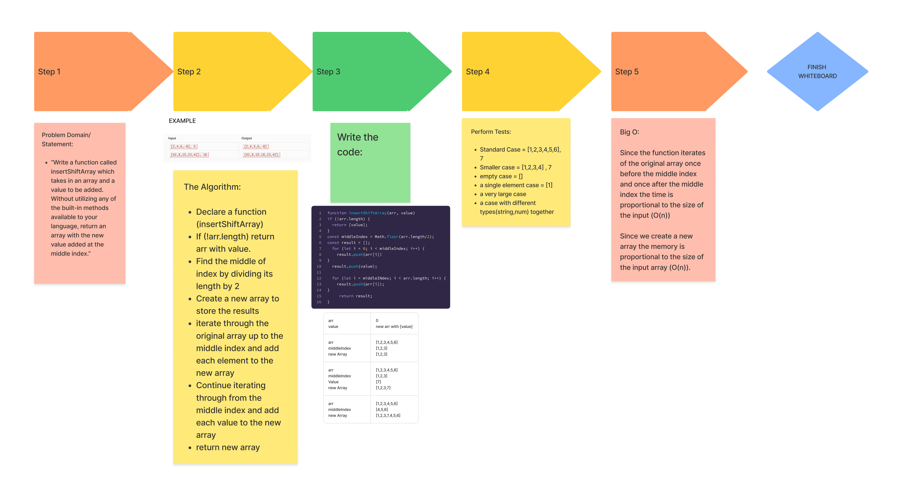

# Challenge Title
WhiteBoard Challenge for Insert and Shift an array in middle at index
<!-- Description of the challenge -->

## Whiteboard Process
<!-- Embedded whiteboard image -->

## Approach & Efficiency
<!-- What approach did you take? Why? What is the Big O space/time for this approach? -->
Since the function iterates of the original array once before the middle index and once after the middle index the time is proportional to the size of the input (O(n))

Since we create a new array the memory is proportional to the size of the input array (O(n)).

