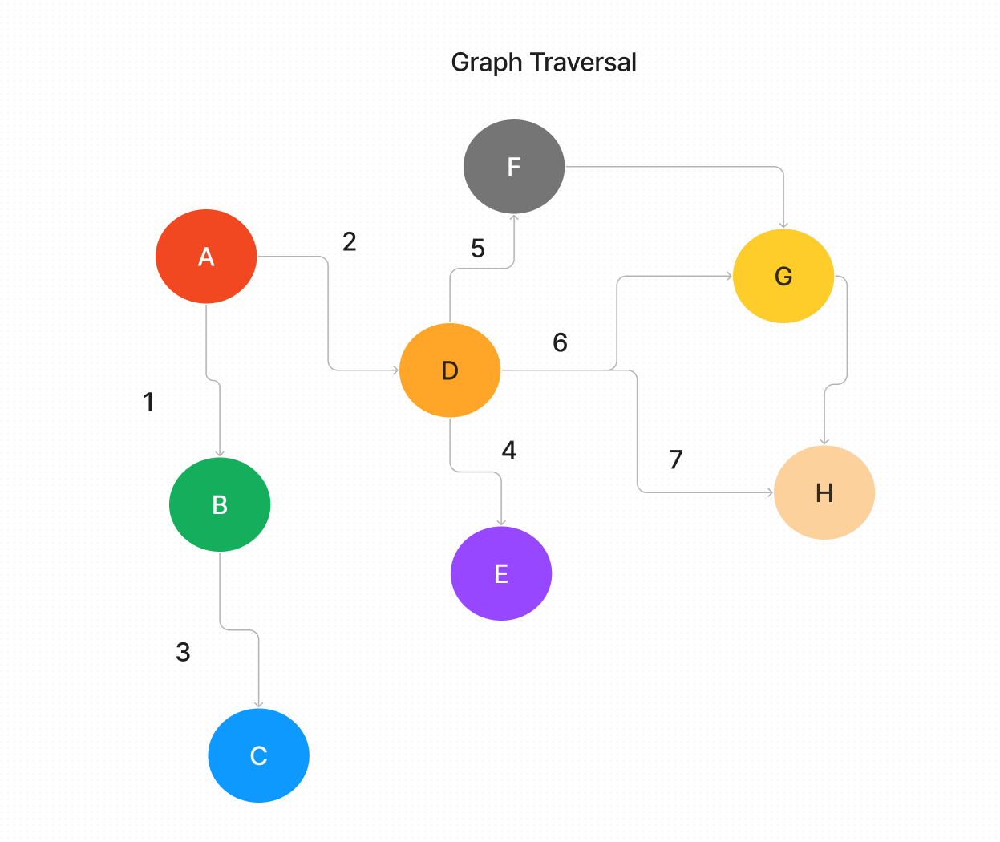

# Code Challenge: Class 35: Graph Implementation
<!-- Description of the challenge -->
The graph should be represented as an adjacency list, and should include the following methods : add vertex, add edge, get vertices, get neighbors, size

## Whiteboard Process
<!-- Embedded whiteboard image -->

## Approach & Efficiency
<!-- What approach did you take? Why? What is the Big O space/time for this approach? -->

## Solution
<!-- Show how to run your code, and examples of it in action -->
