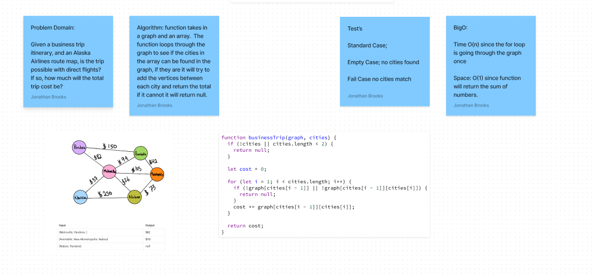

# Code Challenge: Class 38: Graph Depth First
<!-- Description of the challenge -->
Conduct a depth first pre-order traversal on a graph

## Whiteboard Process
<!-- Embedded whiteboard image -->
<!--  -->

## Approach & Efficiency
<!-- What approach did you take? Why? What is the Big O space/time for this approach? -->

## Solution
<!-- Show how to run your code, and examples of it in action -->
