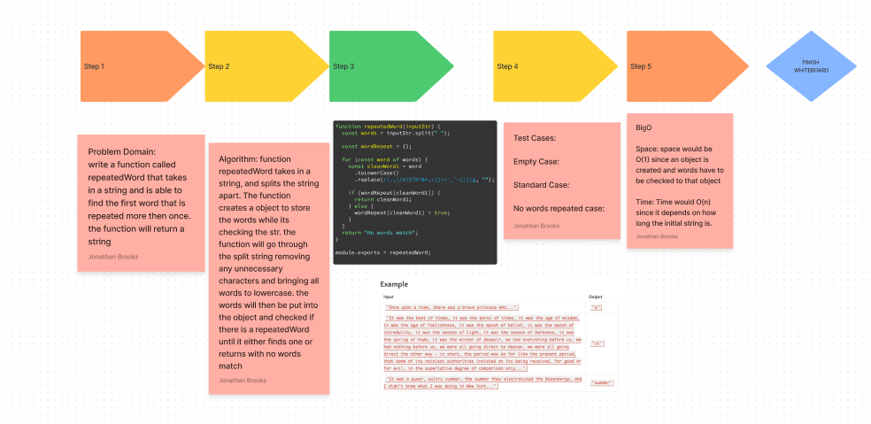

# Code Challenge: Class 30: Hash Table Implementation
<!-- Description of the challenge -->
Implement a HashTable Class with the following methods: set,get,has,keys and hash

## Whiteboard Process
<!-- Embedded whiteboard image -->

## Approach & Efficiency
<!-- What approach did you take? Why? What is the Big O space/time for this approach? -->

## Solution
<!-- Show how to run your code, and examples of it in action -->
