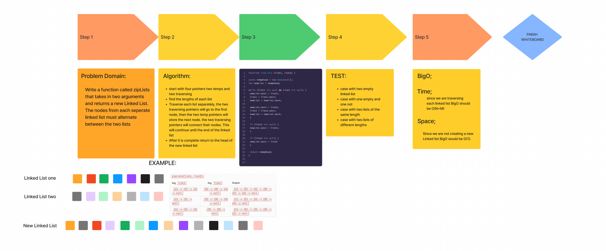
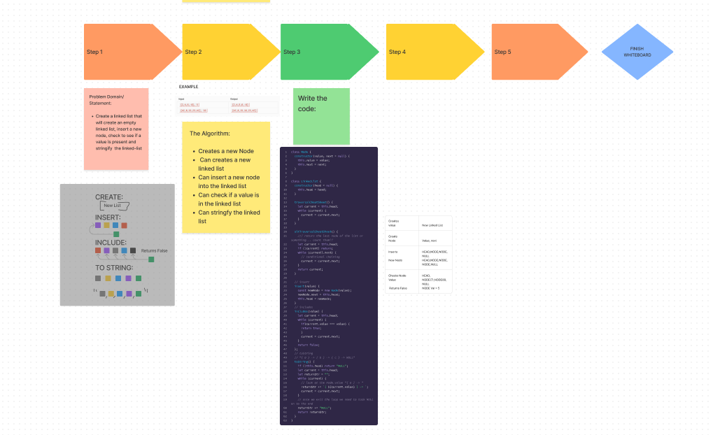

# Linked List Implementation
<!-- Description of the challenge -->
The challenge was to take two linked lists and combine them alternating the nodes until both lists are combined.

## Whiteboard Process

## Approach & Efficiency
<!-- What approach did you take? Why? What is the Big O space/time for this approach? -->
