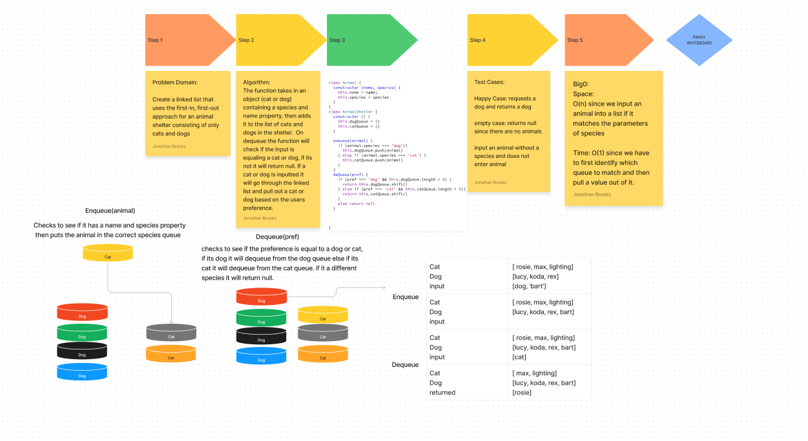

# Animal Shelter
<!-- Description of the challenge -->
the challenge was to add cat and dogs into an animal shelter and dequeue based on the users preference

## Whiteboard Process

## Approach & Efficiency
<!-- What approach did you take? Why? What is the Big O space/time for this approach? -->
