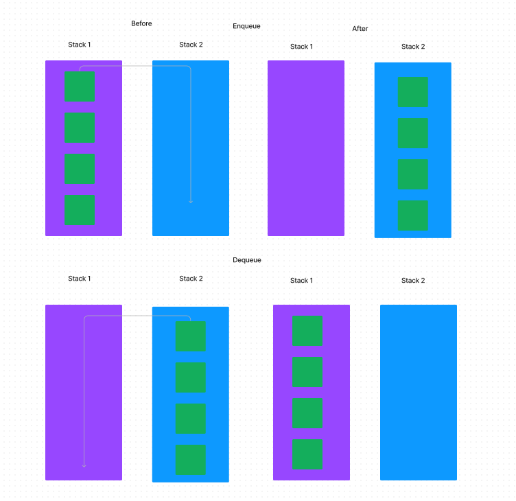

# PseudoQueue
<!-- Description of the challenge -->

this challenge implements two stacks into a queue and perform the enqueue and dequeue functions

## Whiteboard Process

## Approach & Efficiency
<!-- What approach did you take? Why? What is the Big O space/time for this approach? -->
 Space: The space would be O(1) since were using the existing stacks.

Time: Time would be O(n) since dequeue takes one node off the top at a time.
