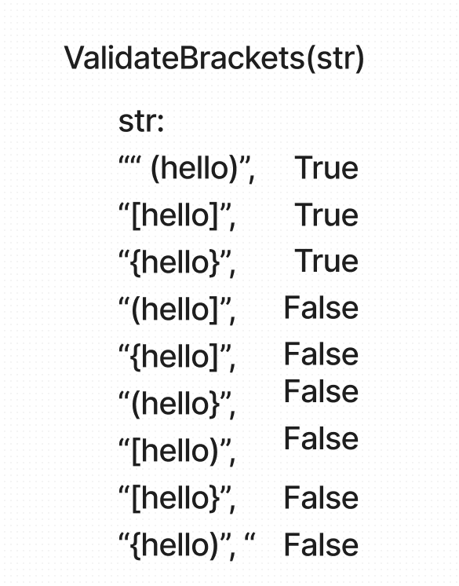

# PseudoQueue
<!-- Description of the challenge -->

this challenge takes a string and verifies if the sting has opening and closing brackets and if they match correctly.

## Whiteboard Process

## Approach & Efficiency
<!-- What approach did you take? Why? What is the Big O space/time for this approach? -->
 Space: The space would be O(1) since were using the existing string.

Time: Time would be O(n) since the function has to verify the string and compare the values of the first and last character
