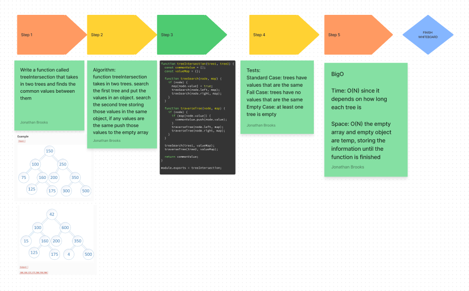

# Code Challenge: Class 32: Tree-Intersection
<!-- Description of the challenge -->
Find common values in 2 binary trees.

## Whiteboard Process
<!-- Embedded whiteboard image -->

## Approach & Efficiency
<!-- What approach did you take? Why? What is the Big O space/time for this approach? -->

## Solution
<!-- Show how to run your code, and examples of it in action -->
