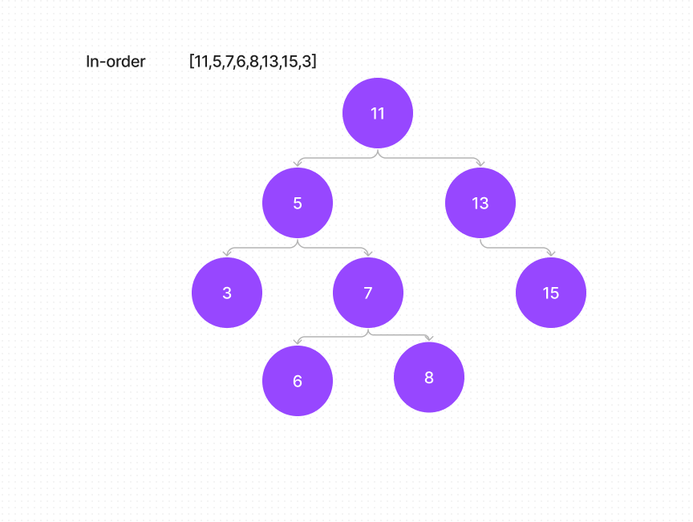

# Code Challenge: 15 Binary Tree
<!-- Description of the challenge -->
This code challenge was to implement a binary  tree and traverse it using pre-order, in-order and post order methods.

## Whiteboard Process
<!-- Embedded whiteboard image -->

## Approach & Efficiency
<!-- What approach did you take? Why? What is the Big O space/time for this approach? -->

## Solution
<!-- Show how to run your code, and examples of it in action -->
